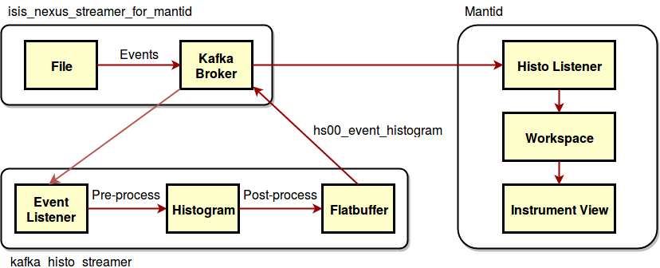
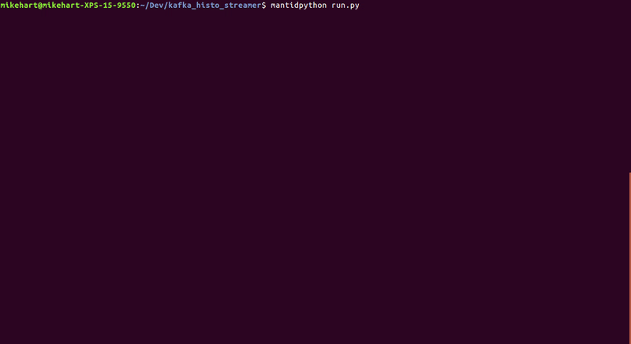
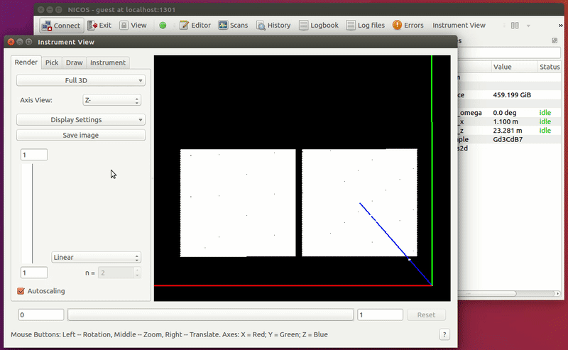

# Kafka Histo Streamer

This is a prototype to test and demonstrate Mantid being capable of live processing event data into histogram data, streaming both via Kafka. Subscribes to a topic with event data and publishes it to another topic as histogram data.

## Requirements

Requires Mantid. As of January 2019, it has to be `nightly`. Going forward, versions 4.0 and above should work.

Virtualenv Python package recommended and used below (`$ pip install virtualenv`).

Running a local demo additionally requires [Docker](https://www.docker.com/) and [ISIS Nexus Streamer](https://github.com/ScreamingUdder/isis_nexus_streamer_for_mantid/).

Already includes the `hs00` schema, and generated code, from the DMSC [Schema Repository](https://github.com/ess-dmsc/streaming-data-types).


## Setup

Ensure [Mantid](https://www.mantidproject.org/Main_Page) is installed.

Clone this repository:

```
$ git clone https://github.com/DMSC-Instrument-Data/kafka_histo_streamer
```


You will want to edit `config.py` to configure `kafka_server` and `kafka_topic`. If you want to run a local demo, we will revisit what these should be set to below.

## Execution

The Histo Streamer must be executed using `mantidpython`, which can be found in the bin directory of your Mantid installation (typically `/opt/Mantid/bin`). There are currently no arguments:

```
user@host:~/kafka_histo_streamer $ mantidpython run.py
```

## Local Demo

Running a local demo requires a Kafka broker, input event data, and Mantid to visualize the output histogram data.

Recommended way of running a local demo:



The Nexus Streamer is started first, to provide a Kafka server and event data. The Histo Streamer is then started to process events into histogram data. Finally, an instance of Mantid is used to consume and visualize the histogram data.

#### Additional Setup

The instructions below assume you are running on Linux. On Mac and Windows you would need to forward ports, since the Docker containers would be running in a virtual machine and the Docker network wouldn't be accessible directly. This is beyond the scope of this document.

To run a local demo, you will need to [install Docker](https://docs.docker.com/install/) and [Docker Compose](https://docs.docker.com/compose/install/), as well as clone the ISIS Nexus Streamer repository:

```
$ git clone https://github.com/ScreamingUdder/isis_nexus_streamer_for_mantid
```

The `docker-compose.yaml` in the top directory needs to be modified as follows:

```diff
   producer:
+    image: screamingudder/nexusproducer:latest
     network_mode: host
-    build: .
```

```diff
-      KAFKA_MESSAGE_MAX_BYTES: 10000000
+      KAFKA_MESSAGE_MAX_BYTES: 25000000
```

It's a good idea to fetch the nexusproducer image, so first time startup is faster later:

```
$ docker pull screamingudder/nexusproducer
```

#### Execution

Launch the ISIS Nexus Streamer using `docker-compose` from within the top directory of its repository:

```
user@host:~/isis_nexus_streamer_for_mantid $ docker-compose up
```

This can take a while to start up. Event data is being published once you see the following messages:

```
producer_1   | Publishing new run:
producer_1   | Run number: 1, Instrument name: SANS2D, Start time: 2019-01-23T09:38:36
```


Once Nexus Streamer is running, we need to find the IP of the Kafka server so we tell the Histo Streamer where to connect. This IP tends to stay the same between startups, so usually this only needs to be done once:

```
$ docker inspect -f '{{.Name}} - {{range .NetworkSettings.Networks}}{{.IPAddress}}{{end}}' $(docker ps -aq)
/isisnexusstreamerformantid_manager_1 - 172.18.0.4
/isisnexusstreamerformantid_producer_1 -
/isisnexusstreamerformantid_kafka_1 - 172.18.0.3
/isisnexusstreamerformantid_zookeeper_1 - 172.18.0.2
```

The `..._kafka_1` IP is the one we want. The `kafka_server` variable in `config.py` needs to be set to this. The port is always `:9092`.

With the IP set correctly and the ISIS Nexus Streamer running, start the histogramming service using `mantidpython`:

```
user@host:~/kafka_histo_streamer $ mantidpython run.py
```



After a short startup period, the histo streamer will process the Events in 5 second chunks as they come in.

With both the Nexus Streamer and the Histo Streamer running, run the following command in Mantid (replacing `Address="172.18.0.3:9092"` with the kafka server IP we found above):

```
StartLiveData(FromNow=True, FromTime=False, FromStartOfRun=False, UpdateEvery=5.0,
              Instrument="SANS2D", Listener="KafkaHistoListener",
              Address="172.18.0.3:9092", RunTransitionBehavior="Stop",
              AccumulationMethod="Replace", OutputWorkspace="histo", InstrumentName="SANS2D")
```

After a startup period again, a workspace named `histo` will appear. You can view the data coming in by right-clicking it and selecting "View Instrument":


The same can be achieved when connecting from the integrated Instrument View in NICOS:


